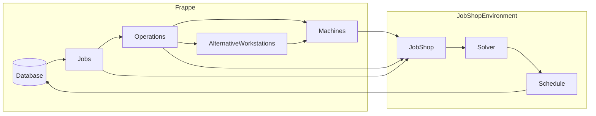

## Job Shop Scheduling Implementation for Frappe Framework

### Overview:
This repository provides a variety of Job Shop Scheduler implementations, including Job Shop Scheduling (JSP), Flow Shop Scheduling (FSP), Flexible Job Shop Scheduling (FJSP), FJSP with Assembly constraints (FAJSP), FJSP with Sequence-Dependent Setup Times (FJSP-SDST), and the online FJSP (with online job arrivals). It aims to adapt these Schedulers for implemented with the Frappe Framework as a multipurpose scheduling environment.

### Solution Methods:
The repository includes exact, heuristic and learning based solution methods, each compatible with one or more machine scheduling problem variants:

| Solution methods | Type | JSP | FSP | FJSP | FJSP SDST | FAJSP | Online (F)JSP |
| :----: | :---:| :---:| :---: | :---: | :---: | :---: | :---: |
| MILP | Exact | ✓ | ✓ | ✓ | ✓ | | | 
| CP-SAT | Exact | ✓ | ✓ | ✓ | ✓ | | |
| Dispatching Rules | Heuristic | ✓ | ✓ | ✓ | ✓ | ✓ | ✓ |
| Genetic Algorithm | Heuristic |✓ | ✓ | ✓ | ✓ | ✓ | |
| FJSP-DRL | DRL | ✓ | ✓ | ✓ | |  | |
| L2D | DRL |✓ | ✓ | | | | |
| DANIEL | DRL | ✓ | ✓ | ✓ | | | |  

### Data Flow Overview:



### User Implementation:

```python
from frappe_parser import FrappeJobShop

  wo_names = [ <list of workorders I want to schedule> ]
  foo = FrappeJobShop(wo_names)
  foo.solve_fjsp()
  foo.plot()
```

```python
# In the future
from frappe_parser import FrappeJobShop

  wo_tree = # <Tree type object of work order implying work order prescedence >
  foo = FrappeJobShop(wo_tree)
  foo.solve_ga()
  schedule = foo.schedule
```
   

### 🏗️ Repository Structure
The repository is structured to provide ease of use and flexibility:
- **Frappe**: Contains the functions to adapt frappe to the Job Shop Environment
- **Configs**: Contains the configuration files for the solution methods.
- **Data**: Contains the problem instances for benchmarking for different problem variants.
- **Data Parsers**: Parsers for configuring the benchmarking instances in the scheduling environment.
- **Plotting**: Contains the plotting functions for visualizing the results.
- **Scheduling Environment**: Defines the core environment components (`job`, `operation`, `machine`, and `jobShop`). Also contains the `simulationEnv` for dynamic scheduling problems with online job arrivals.
- **Solution Methods**: Contains the solution methods, including exact, heuristic, and learning-based approaches.


### 📄 Reference
For more detailed information, please refer this paper. If you use this repository in your research, please consider citing the following paper:

> Reijnen, R., van Straaten, K., Bukhsh, Z., & Zhang, Y. (2023). 
> Job Shop Scheduling Benchmark: Environments and Instances for Learning and Non-learning Methods. 
> arXiv preprint arXiv:2308.12794.
> https://doi.org/10.48550/arXiv.2308.12794

Or, using the following BibTeX entry:
```bibtex
@article{reijnen2023job,
  title={Job Shop Scheduling Benchmark: Environments and Instances for Learning and Non-learning Methods},
  author={Reijnen, Robbert and van Straaten, Kjell and Bukhsh, Zaharah and Zhang, Yingqian},
  journal={arXiv preprint arXiv:2308.12794},
  year={2023}
}
```
A preprint of this paper is available or [arXiv][1]. Please note that this version is a placeholder, and will be updated shortely with the final version.

[1]: https://arxiv.org/abs/2308.12794